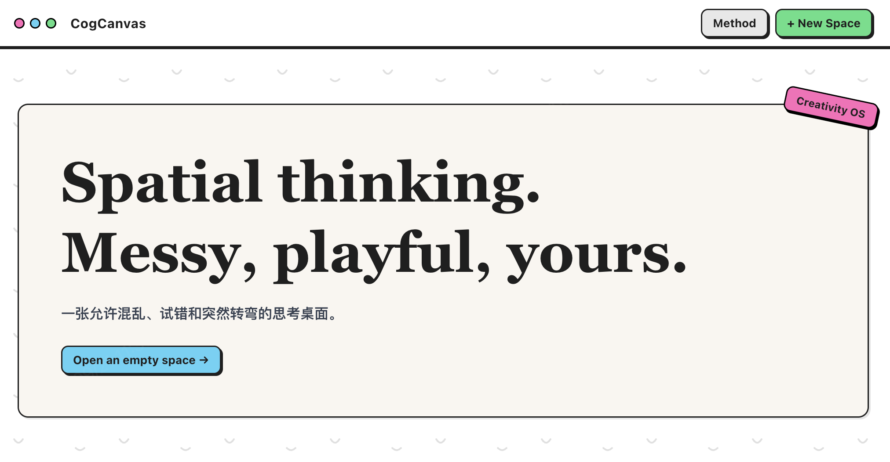

# CogCanvas — 认知科学驱动的创造力画布

一个以无限画布为核心、内置认知科学触发机制的创意辅助工具。
画布不仅是记录空间，更会主动提供打破思维定式的刺激。

## 功能

- **发散记录**：无限画布外部化工作记忆，双击创建节点、拖拽连线，先发散不评判
- **认知触发**：选中节点“抽卡”，5 类认知科学触发卡打破功能固着
- **收敛聚拢**：切换 Converge 模式后，用 TF-IDF 相似度发现并聚拢想法群
- **评估筛选**：为想法打“可行性/主题”标签，看板自动分组
- **精选导出**：勾选精选想法，一键导出 Markdown 交付
- **长文编辑**：双击便签进入独立编辑页，正文跟随画布同步保存
- **后端数据存储**：画布、用户创作记忆与素材库统一由 Node 服务持久化，同时保留 IndexedDB 离线副本
- **RAG 记忆检索**：节点长文、记忆与素材统一进入语义索引；未配置模型时自动使用本地稀疏检索

